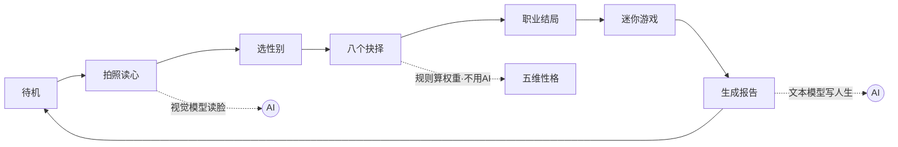
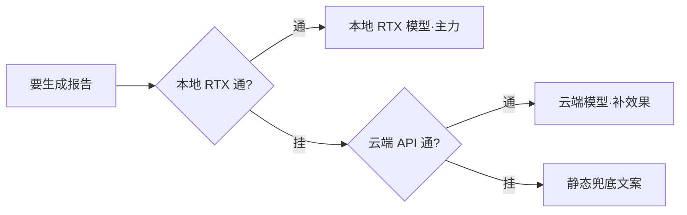

# 《镜像自我·人生预演》技术拆解：一台离线也能跑的 AI 互动影游，是怎么做出来的

这是我们在 bilibili World（B 站线下漫展）英伟达展位上做的一台互动装置：观众对着屏幕上的"镜子"拍张照，AI 读出他此刻的神情，接着走过八个人生选择，最终生成一份只属于他的人生报告，扫码带走。三到五分钟一局，全程可以断网跑。

这篇讲讲它背后的技术是怎么搭起来的——代码基本都是项目里的真实实现（配置文件按推荐值给，实际部署可按机器和网络调整），把几个关键决策和踩过的坑讲清楚，你想做类似的 AI 互动项目可以直接抄。

## 一、先想清楚：它本质上在干一件什么事

抛开花哨的转场，这台机器只做三件事：**把"你"读进来 → 算成一段故事 → 让你带走**。想清楚这条主线，技术选型就顺了。

因为是展台，有两条死约束：一是**网络不可信**（展馆 WiFi 时好时坏），二是**隐私是红线**（观众的脸不能乱传乱存）。这两条直接决定了架构——整个应用是**纯前端**（React + Vite 打包成一堆静态文件，双击就能跑，没有后端服务器），AI 能在本地就在本地跑，照片读完即弃、不落盘。

## 二、整体骨架：一个状态机，串起三个 AI 触点



代码主干是一个前端状态机：每个阶段是一个状态，切换靠一个全局 store 驱动，回到待机就整局清零——展台一天跑几百人，"上一个人的数据绝不带到下一个人"这条必须靠清零兜死。

```ts
export type Phase =
  | 'attract'      // 待机吸引模式
  | 'closeup'      // 镜中特写：拍照/上传 → AI 读心报告
  | 'prologue'     // 序幕：擦亮镜子
  | 'chapter'      // 章节标题卡
  | 'story'        // 抉择节点
  | 'flowchart'    // 章间分支图
  | 'career-intro' // 职业前奏
  | 'game'         // 迷你游戏
  | 'report'       // 终幕报告
```

这条流水线上有三个地方接了 AI：**读脸**、**写人生**，还有中间的**叙事引擎**——但叙事引擎其实不用 AI。八个选择各自给"五维性格"加权重，实时算成一条人生曲线，最后流向五种职业结局：

```ts
applyChoice: (step, effect, boostDominant, regret) => {
  const s = { ...get().stats }
  if (effect) for (const k of Object.keys(effect) as Stat[]) s[k] += effect[k] ?? 0
  if (boostDominant) s[dominantStat(s)] += boostDominant   // 强化当前主导性格
  set({ stats: s, path: [...get().path, step], regret: get().regret || !!regret })
},
```

**能用规则算的别交给 AI**，又快又稳还免费。AI 只留给真正需要"理解和创作"的两处。

## 三、接 AI 的关键：一个可替换的端点 + 流式输出

读脸和写人生都走同一套 OpenAI 兼容接口（业界事实标准，本地的 LM Studio、云端的 OpenAI 都认这套格式）。模型信息全部写在一个配置文件里，改配置就能换模型，代码一个字不用动。下面是一份**推荐配置**——把本地 RTX 放第一级、云端作备份，实际部署时按你的机器和网络调整：

```json
{
  "baseUrl": "http://127.0.0.1:1234/v1",     // 第一级：本地 RTX 上的模型，主力
  "model": "qwen2.5-vl-7b-instruct",
  "visionModel": "qwen2.5-vl-7b-instruct",
  "fallbackBaseUrl": "https://api.openai.com/v1",  // 备份：本地挂了才走云端
  "fallbackModel": "gpt-5.5"
}
```

请求的核心是**流式输出**（`stream: true`）——让文字一个字一个字冒出来，既是"AI 在思考"的演出感，也避免观众干等。前端一边收数据一边往屏幕上刷：

```ts
const reader = res.body.getReader()
const dec = new TextDecoder()
let acc = ''
for (;;) {
  const { done, value } = await reader.read()
  if (done) break
  for (const ln of dec.decode(value, { stream: true }).split('\n')) {
    const s = ln.trim()
    if (!s.startsWith('data:') || s.slice(5).trim() === '[DONE]') continue
    const delta = JSON.parse(s.slice(5)).choices?.[0]?.delta?.content ?? ''
    if (delta) { acc += delta; onText?.(acc) }   // 累计全文，回调刷屏
  }
}
```

还有个关键约定：**纯文本行协议，版面骨架钉死在客户端**。别让 AI 直接吐带格式的成品——它偶尔会抽风。我们在提示词里要求 AI 只产可变内容，段落标题、编号、排版都写死在前端。这里有个小陷阱：给 AI 的格式示例，占位标签要用**真实的词**（比如"手部动作："），别用"标签："这种元词——能力弱一点的模型会把示例里的字原样照抄出来。

## 四、让产出"带得走"：Canvas 海报 + 二维码

报告生成后，前端用 Canvas（网页画布，用代码画图）现场合成一张竖版海报，右下角嵌一个二维码。二维码内容不是短链，而是把整份报告压缩后直接塞进 URL——**离线原则不允许依赖任何外部短链服务**。

## 五、三个真实踩过的坑

**坑一：二维码是"硬预算"资源。** URL 越长，二维码格子越密，超过某个密度手机就扫不出来。我第一次只用"空流程"的短数据测了下"能扫"，结果真实一局（八个选择 + 完整叙事）的链接长得多，现场直接扫不动。修法是把可选字段排成一列降配方案、超预算就逐级砍，取第一个进预算的版本：

```ts
const variants: SharePayload[] = [
  { ...base, ...im, ims: summary },   // 全量：叙事 + 印象 + 读心总结
  { ...base, ...im },                 // 砍读心总结
  trimTl({ ...base, ...im }),         // 砍时间线细节
  base, trimTl(base), noTl(base),     // 逐级砍到只剩叙事全文
]
for (const p of variants) {
  url = await buildShareUrl(p)
  if (url.length <= QR_URL_BUDGET) break   // 第一个进预算的即用
}
```

教训：**凡有长度上限的东西，一定用"最长的真实数据"去测边界**，别拿调试用的短样本糊弄自己。

**坑二：本地部署，先看"真实可用"显存，也要给显卡挑对活。** 一开始我们在一台手头的开发机上试全程本地跑，图个断网可用。这台机器显存本就不宽裕，又被系统和一堆后台程序占掉一截，真正留给模型的所剩无几，本地跑得又慢又不稳。**这不怪显卡，是我们拿了台不趁手的机器来试。接"本地部署"需求，先看真实可用显存——不是标称值，也不是被别的程序占完后剩的那点——再按它挑模型**。等展台换上一块够格的 GeForce RTX，本地 AI 立刻又快又稳：读脸、写人生全在这块显卡上实时算出，不联网也照跑。这正是 RTX 想让人现场摸到的一件事——强大的 AI，可以就在你面前这台电脑上跑。

附带一个坑：**换新一代模型，参数格式会变。** 我们升级到最新的推理型模型，发现它不认老的 `max_tokens`，得换成 `max_completion_tokens` 并单独设推理档位。所以我们按模型代际分开配参数：

```ts
export function completionParams(model: string, maxTokens: number, temperature: number) {
  if (/^gpt-5/i.test(model))   // gpt-5 这代是推理模型，参数不一样
    return { max_completion_tokens: maxTokens + 1500, reasoning_effort: 'low' }
  return { max_tokens: maxTokens, temperature }
}
```

**坑三：多级降级，且如实标注。** 既然本地云端都要，就做成三级链条，前一级挂了自动落下一级：



代码上就是一个 `for` 循环，逐个端点试，成功就返回、失败就落下一级，全挂了才走兜底：

```ts
for (const ep of textEndpoints(cfg)) {   // [本地 RTX, 云端] 依次尝试
  try {
    const res = await fetch(`${ep.baseUrl}/chat/completions`, { /* ... */ })
    if (!res.ok) throw new Error(`HTTP ${res.status}`)
    /* ...流式读取、解析... */
    return { ...parsed, fromAI: true, stats: { local: isLocalUrl(ep.baseUrl) } }
  } catch (e) {
    console.warn(`[ai] 端点不可用(${ep.baseUrl})，尝试下一级`, e)
  }
}
return templateReport(input)   // 全挂 → 静态兜底
```

关键是**每一级的来源要如实告诉用户**（`local` 字段标清是云端还是本地生成），别为了好看假装。兜底文案我们还特意留了记号，一看就知道是哪一级在输出，排错快得多。

## 六、几条可复用的心法

1. **先定"体验流"再写代码。** 把用户从头到尾的每一步画出来（就像上面那张状态机图），代码只是把这条流水线实现出来。
2. **能用规则算的别用 AI。** AI 只用在真正需要理解和创作的地方，权重、分支这些交给普通代码。
3. **AI 的输出当"填空"，不当"排版"。** 骨架你定死，AI 只填可变内容，稳定性立刻上一个台阶。
4. **给不确定留后路。** 网络、模型、显存都可能出问题，每个都配一层降级，展台才敢开一整天。

这台机器的主体是在大约 36 小时里从零搭起来的。回头看，真正花时间的不是写代码，而是把"体验流"和"每一层的兜底"想清楚。你要做自己的 AI 互动项目，也建议从这两件事开始。
