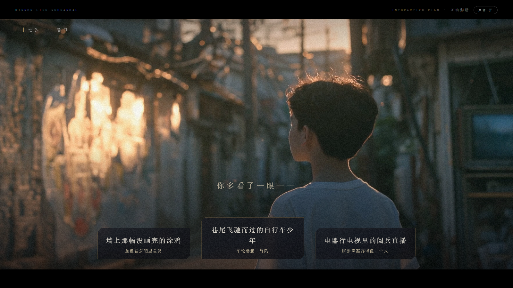
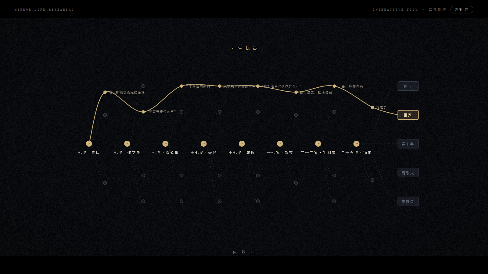
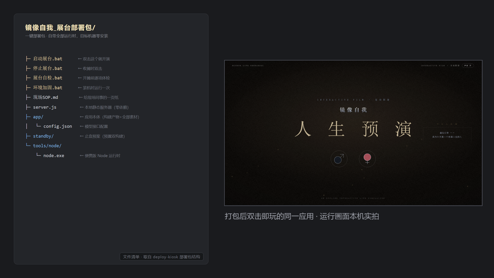
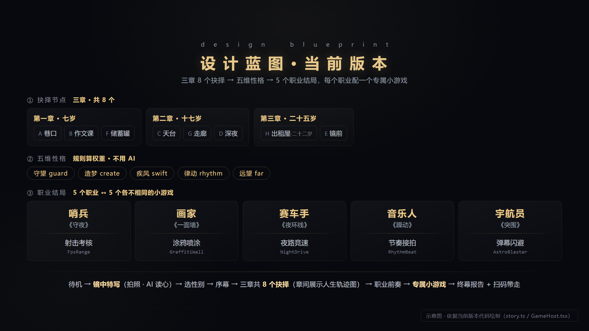
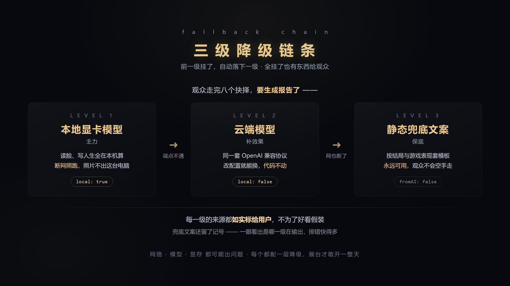

# 一台离线也能跑的 AI 互动影游怎么做

## 一、成品展示

一台放在展台上的互动装置：观众对着屏幕上的"镜子"拍张照，AI 读出他此刻的神情，接着走过八个人生抉择，最终生成一份只属于他的人生报告，扫码带走。**三到五分钟一局，全程可以断网跑。**



抉择不是选完就算了。每章结束会把走过的路画成一条金色曲线，八个节点、五条职业线，灰色的是没选的分支——观众一眼能看见"另一种人生长什么样"。



曲线尽头是五个职业结局，每个职业还各带一个**自己的**小游戏——哨兵打靶、画家喷涂、赛车手夜路竞速、音乐人接拍、宇航员躲弹幕，玩完才出报告。

最终交付物是一个**双击就能玩的文件夹**：目标机器不装 Node、不装依赖、不连网，双击 `启动展台.bat` 就开演。



本文讲它背后的技术怎么搭起来。代码都是项目里的真实实现（配置文件按推荐值给，实际部署按机器和网络调整），你想做类似的 AI 互动项目可以直接抄。

---

## 二、所用工具

### 1. React + Vite —— 应用本体

前端框架 + 打包工具。整个应用是**纯前端**：打包出来就是一堆静态文件，没有后端服务器，不需要数据库。

官网地址：https://vite.dev

适用场景：需要"一个文件夹拷过去就能跑"的展台装置、单页应用、离线工具。

### 2. LM Studio —— 在本机显卡上跑模型

把大模型加载到本地显卡上，对外暴露一个 **OpenAI 兼容接口**（`http://127.0.0.1:1234/v1`）。前端把它当成一个普通的 API 端点来调，代码和调云端一模一样。

官网地址：https://lmstudio.ai

适用场景：断网要能用、数据不能出本机的场合。同类工具还有 Ollama、llama.cpp。

### 3. 模型：一个视觉 + 一个文本

读脸用视觉模型（本项目用 `qwen2.5-vl-7b-instruct`），写人生报告用文本模型。两者都走同一套 OpenAI 兼容协议——**这是全篇最重要的一条选型**：本地和云端认同一套格式，改配置就能换，代码一个字不用动。

适用场景：本地跑主力、云端作备份的双活方案。

### 4. Canvas + 二维码生成

网页画布，用代码现场画出一张竖版海报，右下角嵌二维码。二维码里塞的是整份报告本身，不是短链——离线原则不允许依赖任何外部短链服务。

适用场景：需要让观众"把结果带走"的现场装置。

### 5. 便携版 Node —— 本地静态服务器

部署包里自带一个 `node.exe` 和一个零依赖的 `server.js`，目标机器**零安装**。

适用场景：展台机、客户机这类"不允许你装环境"的电脑。

---

## 三、操作方法

### 步骤 1：先画体验流，再写代码

抛开花哨的转场，这台机器只做三件事：**把"你"读进来 → 算成一段故事 → 让你带走**。

动手前先把用户从头到尾的每一步画出来，包括每个抉择节点、每条职业线、每个 AI 触点。这张表定下来，后面写代码只是把它实现出来。



注意最后一行——**五个职业不是五张不同的结局图，而是五个各不相同的小游戏**：哨兵打靶、画家喷涂、赛车手夜路竞速、音乐人接拍、宇航员躲弹幕。这是整个项目里最贵的一块，也是观众留在展台前最久的一块。蓝图阶段就要把它标成五个独立条目，不然很容易在排期时被当成"一个小游戏换五套皮"。

代码主干就是一个前端状态机，每个阶段是一个状态：

```ts
export type Phase =
  | 'attract'      // 待机吸引模式
  | 'closeup'      // 镜中特写：拍照/上传 → AI 读心报告
  | 'prologue'     // 序幕：擦亮镜子
  | 'chapter'      // 章节标题卡
  | 'story'        // 抉择节点
  | 'flowchart'    // 章间分支图
  | 'career-intro' // 职业前奏
  | 'game'         // 专属小游戏：五个职业各跑各的
  | 'report'       // 终幕报告
```

切换靠一个全局 store 驱动，**回到待机就整局清零**——展台一天跑几百人，"上一个人的数据绝不带到下一个人"这条必须靠清零兜死。

### 步骤 2：能用规则算的，别交给 AI

这条流水线上看着有三处该用 AI，其实只有两处需要。中间的叙事引擎完全不用 AI：八个选择各自给"五维性格"加权重，实时算成一条人生曲线，最后流向五种职业结局。

```ts
applyChoice: (step, effect, boostDominant, regret) => {
  const s = { ...get().stats }
  if (effect) for (const k of Object.keys(effect) as Stat[]) s[k] += effect[k] ?? 0
  if (boostDominant) s[dominantStat(s)] += boostDominant   // 强化当前主导性格
  set({ stats: s, path: [...get().path, step], regret: get().regret || !!regret })
},
```

结局定下来，跑哪个小游戏也就跟着定了——同样是纯规则，一个组件按结局分发：

```tsx
{career === 'soldier'   && <FpsRange />}      // 哨兵《守夜》· 射击考核
{career === 'painter'   && <GraffitiWall />}  // 画家《一面墙》· 涂鸦喷涂
{career === 'racer'     && <NightDrive />}    // 赛车手《夜环线》· 夜路竞速
{career === 'musician'  && <RhythmBeat />}    // 音乐人《躁动》· 节奏接拍
{career === 'astronaut' && <AstroBlaster />}  // 宇航员《突围》· 弹幕闪避
```

规则算，又快又稳还免费。AI 只留给真正需要"理解和创作"的两处：**读脸**和**写人生**。

### 步骤 3：接 AI —— 可替换端点 + 流式输出

模型信息全部写在一个配置文件里。下面是一份**推荐配置**，把本地放第一级、云端作备份：

```json
{
  "baseUrl": "http://127.0.0.1:1234/v1",     // 第一级：本地显卡上的模型，主力
  "model": "qwen2.5-vl-7b-instruct",
  "visionModel": "qwen2.5-vl-7b-instruct",
  "fallbackBaseUrl": "https://api.openai.com/v1",  // 备份：本地挂了才走云端
  "fallbackModel": "gpt-5.5"
}
```

请求的核心是**流式输出**（`stream: true`）——让文字一个字一个字冒出来，既是"AI 在思考"的演出感，也避免观众干等：

```ts
const reader = res.body.getReader()
const dec = new TextDecoder()
let acc = ''
for (;;) {
  const { done, value } = await reader.read()
  if (done) break
  for (const ln of dec.decode(value, { stream: true }).split('\n')) {
    const s = ln.trim()
    if (!s.startsWith('data:') || s.slice(5).trim() === '[DONE]') continue
    const delta = JSON.parse(s.slice(5)).choices?.[0]?.delta?.content ?? ''
    if (delta) { acc += delta; onText?.(acc) }   // 累计全文，回调刷屏
  }
}
```

还有个关键约定：**纯文本行协议，版面骨架钉死在客户端**。别让 AI 直接吐带格式的成品——它偶尔会抽风。提示词里只要求 AI 产可变内容，段落标题、编号、排版都写死在前端。

### 步骤 4：让产出"带得走"

报告生成后，前端用 Canvas 现场合成一张竖版海报，右下角嵌二维码。二维码内容不是短链，而是把整份报告压缩后**直接塞进 URL**。

这里有个硬约束：URL 越长，二维码格子越密，超过某个密度手机就扫不出来。所以把可选字段排成一列降配方案，超预算就逐级砍，取第一个进预算的版本：

```ts
const variants: SharePayload[] = [
  { ...base, ...im, ims: summary },   // 全量：叙事 + 印象 + 读心总结
  { ...base, ...im },                 // 砍读心总结
  trimTl({ ...base, ...im }),         // 砍时间线细节
  base, trimTl(base), noTl(base),     // 逐级砍到只剩叙事全文
]
for (const p of variants) {
  url = await buildShareUrl(p)
  if (url.length <= QR_URL_BUDGET) break   // 第一个进预算的即用
}
```

### 步骤 5：给每一层配降级，再打包成"双击即玩"

本地和云端都要，就做成三级链条，前一级挂了自动落下一级：



代码上就是一个 `for` 循环，逐个端点试，成功就返回、失败就落下一级：

```ts
for (const ep of textEndpoints(cfg)) {   // [本地, 云端] 依次尝试
  try {
    const res = await fetch(`${ep.baseUrl}/chat/completions`, { /* ... */ })
    if (!res.ok) throw new Error(`HTTP ${res.status}`)
    /* ...流式读取、解析... */
    return { ...parsed, fromAI: true, stats: { local: isLocalUrl(ep.baseUrl) } }
  } catch (e) {
    console.warn(`[ai] 端点不可用(${ep.baseUrl})，尝试下一级`, e)
  }
}
return templateReport(input)   // 全挂 → 静态兜底
```

**每一级的来源要如实告诉用户**（`local` 字段标清是云端还是本地生成），别为了好看假装。兜底文案也留了记号，一看就知道是哪一级在输出，排错快得多。

最后打包：构建产物 + 素材 + 便携 Node + 几个 `.bat`，装进一个文件夹拷到展台机，双击即玩（部署包结构见第一节最后那张图）。

---

## 四、总结与小技巧

这台机器的主体是在大约 36 小时里从零搭起来的。回头看，真正花时间的不是写代码，而是把"体验流"和"每一层的兜底"想清楚。要做自己的 AI 互动项目，建议也从这两件事开始。

**四条可复用的心法**

1. **先定体验流再写代码。** 把用户从头到尾的每一步画出来，代码只是把这条流水线实现出来。
2. **能用规则算的别用 AI。** 权重、分支这些交给普通代码，AI 只用在真正需要理解和创作的地方。
3. **AI 的输出当"填空"，不当"排版"。** 骨架你定死，AI 只填可变内容，稳定性立刻上一个台阶。
4. **给不确定留后路。** 网络、模型、显存都可能出问题，每个都配一层降级，展台才敢开一整天。

**四条踩过坑才知道的小技巧**

- **凡有长度上限的东西，用"最长的真实数据"去测边界。** 二维码那条坑就是这么栽的：第一次只用"空流程"的短数据测了下能扫，结果真实一局（八个选择 + 完整叙事）的链接长得多，现场直接扫不动。
- **接"本地部署"需求，先看真实可用显存。** 不是标称值，也不是被别的程序占完后剩的那点。一开始拿一台手头的开发机试全程本地跑，显存本就不宽裕又被后台占掉一截，跑得又慢又不稳——这不怪显卡，是机器不趁手。换上一块显存够格的独立显卡后，读脸、写人生全在本机实时算出，不联网也照跑。
- **换新一代模型，参数格式会变。** 推理型模型不认老的 `max_tokens`，得换成 `max_completion_tokens` 并单独设推理档位。按模型代际分开配参数：

  ```ts
  export function completionParams(model: string, maxTokens: number, temperature: number) {
    if (/^gpt-5/i.test(model))   // gpt-5 这代是推理模型，参数不一样
      return { max_completion_tokens: maxTokens + 1500, reasoning_effort: 'low' }
    return { max_tokens: maxTokens, temperature }
  }
  ```

- **给 AI 的格式示例，占位标签要用真实的词。** 比如写"手部动作："，别用"标签："这种元词——能力弱一点的模型会把示例里的字原样照抄出来。
